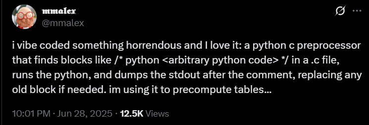
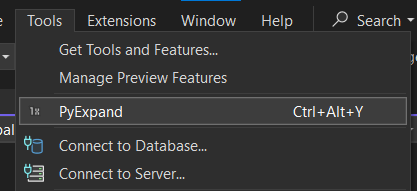

# PyExpand
Write python expressions in C/C++ comments and expand it into code underneath!

Windows-only for now.

Inspired by a [tweet by @mmalex](https://x.com/mmalex/status/1939051429060018590):



# How to build

1. Download [premake5](https://premake.github.io/download) and Visual Studio 2022.
2. In the root directory, run `premake5 vs2022`. Open the generated VS solution in the `.vs2022` folder and build the solution.
3. The generated executable will be in the `.build` folder. Add this folder to your `PATH` environment variable.

# Usage

You can run the tool in the command line: `PyExpand [file]`. This will parse the file for comments of the form `/*.py ... */`, evaluate the python code inside, and write the result back to the file after the comment and before the next `/*`.

For example, the following line:
```cpp
int my_number = /*.py 5*5 - 4 *//**/;
```

... will expand into
```cpp
int my_number = /*.py 5*5 - 4 */ 21 /**/;
```

You can also write multi-line python code, in which case the code should be a python function body that returns a value:
```cpp
#include <stdio.h>

/*.py
	squares = []
	for i in range(25):
		squares.append(i*i)
	return "int squares[] = {" + str(squares)[1:-1] + "};"
*/
int squares[] = {0, 1, 4, 9, 16, 25, 36, 49, 64, 81, 100, 121, 144, 169, 196, 225, 256, 289, 324, 361, 400, 441, 484, 529, 576};
/**/

int main()
{
    for (int i = 0; i < 25; i++)
        printf("Square: %d\n", squares[i]);
    return 0;
}
```

# Using the Visual Studio extension



Double click the `VSPyExpand.vsix` in the root directory to install the extension into your Visual Studio. The extension adds a "PyExpand" command into the "Tools" menu that runs PyExpand on the currently open file, also bound to Ctrl+Alt+Y. For this to work, you must have the folder containing `PyExpand.exe` in your `PATH`!